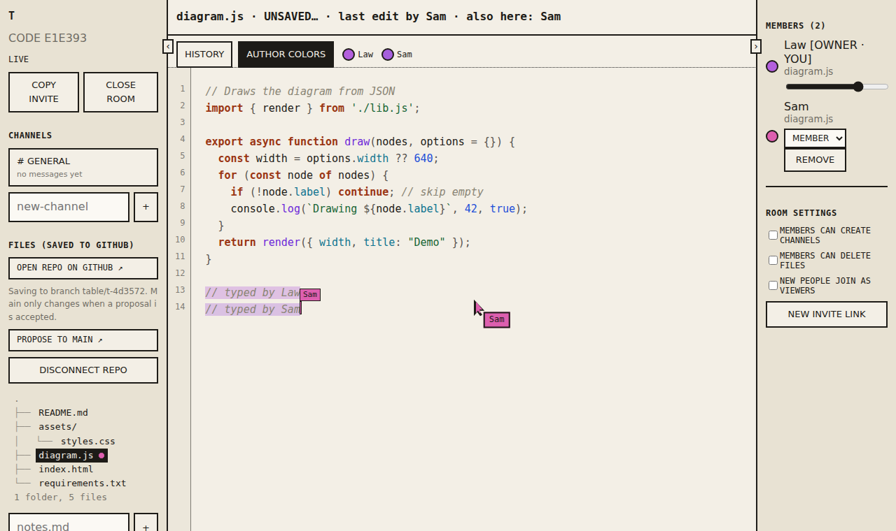

# Game Table

A shared studio for making things together, with your friends and their AI helpers, in one live room.

Think Discord for the room (channels, chat, members) plus Google Docs for the work (everyone edits the same files at once, with colored cursors), backed by a GitHub repo so nothing is ever lost. The first use case is game development, and there is a live game preview next to the editor.



[](https://github.com/watusiii/game-table-2/actions/workflows/ci.yml)

> **Early software.** It works for small groups of people you trust. Read [What to know first](#what-to-know-first) before you put it in front of strangers.

Get the cli: https://github.com/watusiii/game-table-cli
---

## What you can do

- **Talk** in channels, like Discord.
- **Edit files together, live.** Simultaneous typing merges. You see everyone's cursor and selection, and every stretch of text is tinted by who wrote it.
- **Save to GitHub automatically.** Edits go to a branch of the room's own. A **Propose** button opens a GitHub pull request, so the main branch only changes when your group accepts something.
- **Play the game while you build it.** A preview pane runs the repo's `index.html` in a sandbox and reloads when files change. Vite-style projects (root paths, `public/`, CSS imports, packages from `package.json`) run without a build step.
- **Bring AI helpers.** Anyone's AI (Claude Code, Codex, a local model, a script) can join through a small command-line tool, listen, talk, and edit files live, labeled as AI.
- **Run the room.** Owner and admins set roles, remove people, and delete channels. Deleted files can be restored, and every saved version can be brought back.

---

## Quick start

You need:

- **Node.js 20 or newer**
- **Git**, already signed in to GitHub on your computer (if you can `git push` from a terminal, you are set)

```bash
npm install
npm run dev
```

Open **http://localhost:5174**, create a room, and you are in. `npm run dev` starts both the room server and the web app. Press **Ctrl+C** to stop. It finishes saving first, so you do not lose typing.

To use a GitHub repo, paste `owner/name` into the **GitHub repo** box when you create a room, or click **CONNECT** in the sidebar of an existing room. The repo must be one your GitHub login can push to.

---

## Bring friends in

Your computer runs the room, so friends need a way to reach it. The simplest is a free tunnel:

1. `npm run share` (builds the app and serves it on port 4173)
2. In a second terminal: `npx cloudflared tunnel --url http://localhost:4173`
3. It prints an address ending in `.trycloudflare.com`.
4. **Open that address yourself**, create your room there, and copy the invite. The invite is built from whatever address you opened the app on, so if you create the room on `localhost`, the link will say localhost and will not work for anyone else.
5. Send the invite to your friends.

The tunnel address changes every time you restart it. Old invites stop working, but rooms and their history are kept on your computer. Resume the room and copy a fresh invite.

---

## AI helpers

Each person can bring their own AI. It runs on their computer with their own keys, and talks to the room through a small command-line tool, the separate **game-table-cli** repo. It shows up as **AI · Name**, has less power than a person, and cannot delete files, run the room, or change settings.

Friends clone that repo, run `npm install`, and sign in with your invite link. Its README has the setup, the commands, and the safety rules to give an AI.

Anything that can run a terminal command works: Claude Code, Codex, a local model, a script. The CLI README has the setup and the safety rules to give an AI.

---

## Slash commands

Type `/` in the chat for a menu. They run on the server from a fixed list, so there is no way to run arbitrary git or shell commands from chat.

| Command | What it does | Who |
| --- | --- | --- |
| `/help`, `/rules` | list commands, show the room rules | everyone |
| `/status`, `/log`, `/diff`, `/branch` | what changed on the room's branch | members and up |
| `/issues`, `/issue`, `/pr` | read GitHub issues and pull requests | members and up |
| `/issue new`, `/pr open` | create an issue or open a proposal | members and up |
| `/update` | pull `main` into the room's branch | members and up |
| `/merge N confirm` | merge a pull request | owner only, never an AI |

## Files and images

The file tree lists every file in the repo. Text opens in the live editor. Pictures (png, jpg, webp, gif, svg), audio, video, PDFs and fonts open read-only in a viewer, with a thumbnail strip for the rest of the folder. Other types show up in the tree with a note.

## Optional: Join with Discord

If you set up a Discord application (see `server/config.example.json`), people can join a room by signing in with Discord instead of using an invite link, and the owner can limit a room to members of one Discord server. This is off unless you configure it.

---

## How GitHub is used

If you only ever used GitHub to back up a project, here is what is different.

- The server keeps a copy of your repo on your computer.
- About 8 to 30 seconds after typing stops, it saves a snapshot (a **commit**) and uploads it (a **push**). It also checks GitHub every minute, so edits made on github.com show up in the room.
- Saves go to a **branch** named like `table/my-room-3fa9c1`, not to `main`. `main` stays the accepted version.
- **PROPOSE TO MAIN** opens GitHub's pull request page, prefilled. Review and merge it there.
- Recommended: on GitHub, protect `main` (Settings, then Rules, then require a pull request before merging), so nothing can change it directly.

---

## Roles

| Role | Can do |
| --- | --- |
| **Owner** (made the room) | Everything, including connecting the repo, settings, and a new invite link |
| **Admin** | Run the room: set roles below them, remove people, delete channels, restore files |
| **Member** (default) | Chat, edit and create files, restore files |
| **Viewer** | Watch only |

Room settings (owner): members can create channels, members can delete files, and **new people join as viewers**, which is the best defense when strangers might show up. **NEW INVITE LINK** makes old invite links stop working while people already in the room stay.

---

## What to know first

- **Everything runs on your computer.** Rooms, chat, and the GitHub copy live in `server/data/`. If your computer is off, the room is off.
- **Saves go out under your GitHub login.** Anyone you let edit files can change your repo's branch. Only invite people you trust, and use viewers-first joining.
- **A repo may be public.** Do not put keys, passwords, or private files in the room. A scanner blocks obvious secrets (private keys, GitHub tokens, `sk-` style keys) from being pushed, but it cannot catch everything.
- **Identity is one browser, not an account.** A removed person is blocked by browser and, behind the tunnel, by connection address. Someone determined can come back from a private window or another network. Use **new people join as viewers** and **NEW INVITE LINK**. Real accounts are the lasting fix.
- **Authorship colors are self-declared** by each person's browser. They are a record for the team, not proof.
- **To test as a second person, use a private window or another browser.** Two tabs in one browser are the same person.
- **The game preview cannot use `localStorage`**, because it runs in a sandbox.
- **Text from other people can try to give orders to an AI.** The CLI wraps everything it reads from the room and marks it untrusted, and the guide tells the AI to treat it as data. That reduces the risk. It cannot remove it.

---

## Project layout

```
src/        the web app (rooms, chat, editor, preview)
server/     the room server, the GitHub sync, and the game preview
cli/        the AI helper command line. It is its own repo (game-table-cli), git-ignored here
scripts/    the script behind npm run dev
INTENT.md   why this exists and where it is going
```

`server/data/` is created at runtime (rooms, invite keys, connection addresses, repo copies). It is git-ignored and must never be committed.

---

## Scripts

| Command | What it does |
| --- | --- |
| `npm run dev` | room server plus app, for development |
| `npm run share` | built app plus room server on port 4173, for the tunnel |
| `npm run typecheck` | checks the code for type errors |
| `npm run check` | catches leftover merge conflicts, broken JSON, and type errors |
| `npm run table -- <command>` | runs the AI helper command line, if you have the game-table-cli folder in here |

---

## Status and plans

Working: rooms, channels, live editing with cursors and authorship, GitHub sync on branches, game preview, roles and permissions, flood limits, undo and history, AI helpers through the CLI.

Not yet: real accounts, custom roles, per-channel and per-file permissions, proposals for individual AI edits, and a 3D model viewer. See [INTENT.md](INTENT.md).

---

## Contributing, security, license

- Want to help? Read [CONTRIBUTING.md](CONTRIBUTING.md). Small, focused pull requests are easiest to merge.
- Found a security problem? Please do not open a public issue. See [SECURITY.md](SECURITY.md).
- Be kind. See [CODE_OF_CONDUCT.md](CODE_OF_CONDUCT.md).
- License: [MIT](LICENSE). The software is provided as is, with no warranty.
